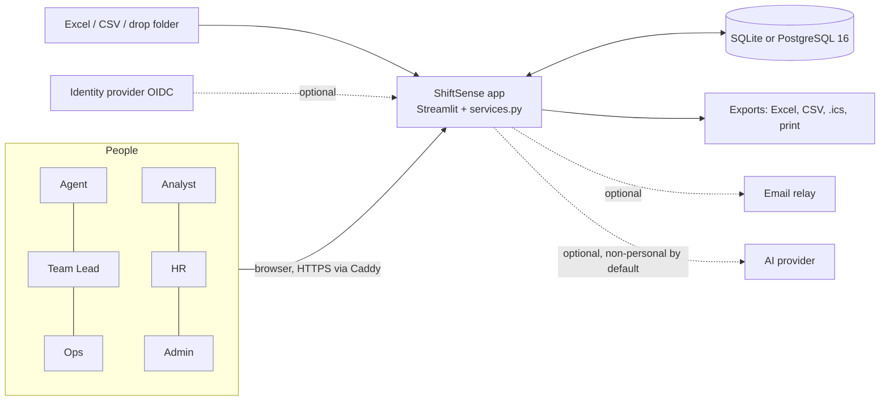
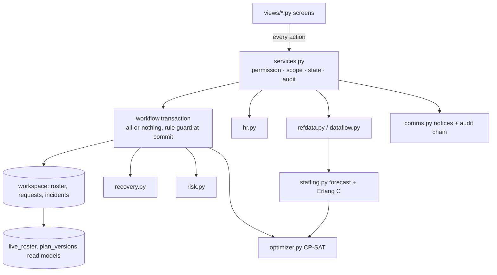
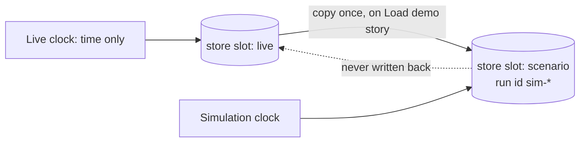
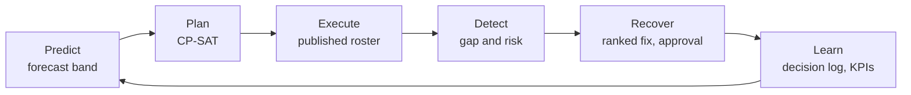

# Data-flow diagrams

## 1. Context

```mermaid
flowchart LR
  subgraph People
    AG[Agent]:::r --- TL[Team Lead]:::r --- OP[Ops]:::r
    AN[Analyst]:::r --- HRr[HR]:::r --- AD[Admin]:::r
  end
  People -->|browser, HTTPS via Caddy| APP[ShiftSense app<br/>Streamlit + services.py]
  APP <--> DB[(SQLite or PostgreSQL 16)]
  FILES[Excel / CSV / drop folder] --> APP
  APP --> EXP[Exports: Excel, CSV, .ics, print]
  APP -. optional .-> SMTP[Email relay]
  IDP[Identity provider OIDC] -. optional .-> APP
  APP -. optional, non-personal by default .-> AI[AI provider]
  classDef r fill:#eef,stroke:#88a
```

## 2. Inside the app

```mermaid
flowchart TB
  V[views/*.py screens] -->|every action| S[services.py<br/>permission · scope · state · audit]
  S --> W[workflow.transaction<br/>all-or-nothing, rule guard at commit]
  W --> WS[(workspace: roster, requests, incidents)]
  S --> HR[hr.py]
  S --> RD[refdata.py / dataflow.py]
  S --> CM[comms.py notices + audit chain]
  W --> OPT[optimizer.py CP-SAT] & REC[recovery.py] & RK[risk.py]
  ST[staffing.py forecast + Erlang C] --> OPT
  RD --> ST
  WS --> RM[(live_roster, plan_versions read models)]
```

## 3. Live vs demo isolation

```mermaid
flowchart LR
  L[(store slot: live)] -->|copy once, on Load demo story| D[(store slot: scenario<br/>run id sim-*)]
  D -. never written back .-> L
  SC[Simulation clock] --> D
  LC[Live clock: time only] --> L
```

## 4. Plan → Detect → Recover loop

```mermaid
flowchart LR
  P[Predict<br/>forecast band] --> PL[Plan<br/>CP-SAT] --> EX[Execute<br/>published roster]
  EX --> DT[Detect<br/>gap and risk] --> RC[Recover<br/>ranked fix, approval] --> LN[Learn<br/>decision log, KPIs] --> P
```

Column-level lineage: `data-lineage-and-transformations.xlsx`.
